# 事前准备
1. 已部署好Page
2. 准备至少2个域名（这里准备了`acwfock.me` 做访问域名 `cardinal.qzz.io` 做辅助域名）

# 正式开始
登录 [cloudflare](https://dash.cloudflare.com) 在账户主页添加域
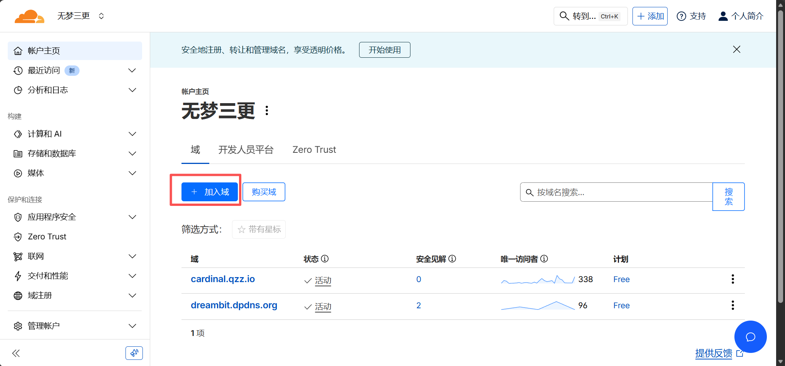

建议仅添加一个，其他的解析到别的地方（如： `阿里云` 、 `腾讯云` ），如果非要都解析到 `cloudflare` 需保证几个域名的 `名称服务器` 的 ns 记录不一致。否则你就会碰到第一个坑（错误1000）
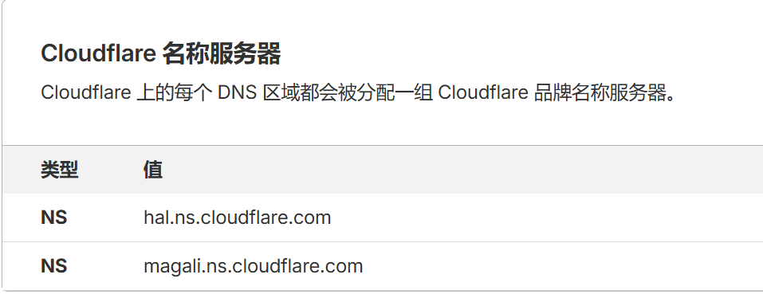
至此 `名称服务器` 设置完毕。

让我们进入 `cardinal.qzz.io` - `DNS` 开始配置新增一条DNS解析指向Pages（Pages的域名默认为 `项目名.pages.dev`）

进入 `SSL/TLS` - `自定义主机名` ，将我们新加的记录 `blog.cardinal.qzz.io` 填入回退源。
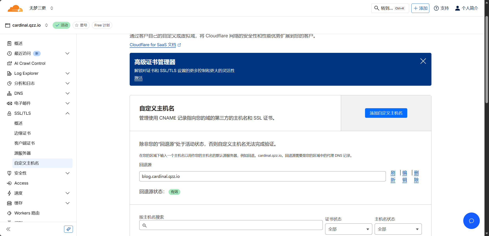
添加自定义主机名，填入访问域名 `www.acwfock.me`。
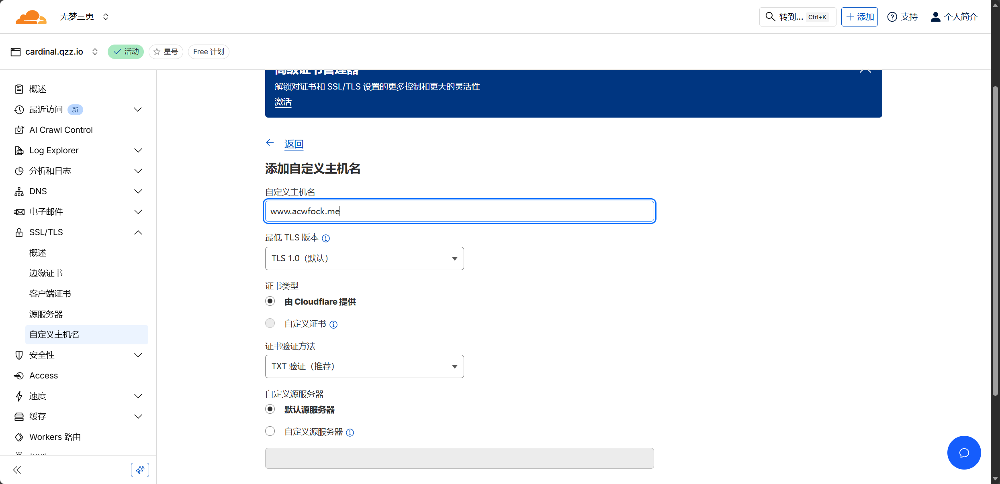
返回访问域名解析，添加TXT记录
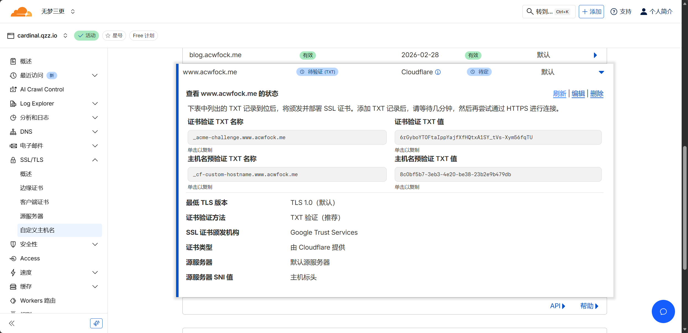
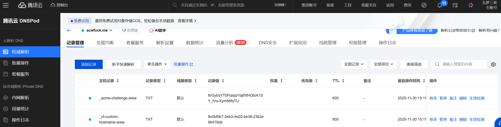
等待DNS生效即可

返回主页，进入 `计算和AI` - `Workers 和 Pages`
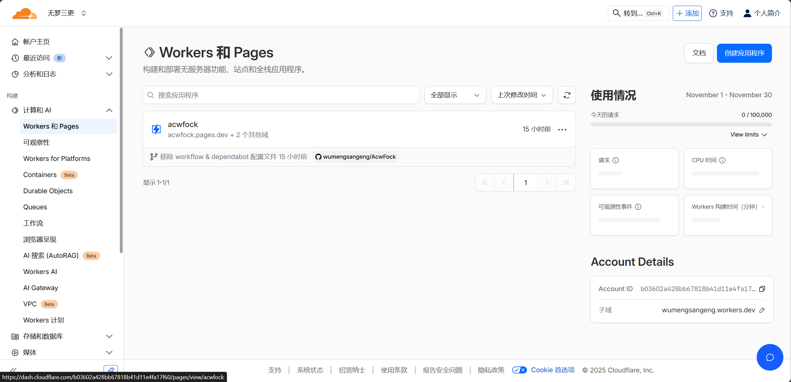
进入自定义域，点击设置自定义域名。

添加我们的访问域名`不要添加辅助域名！` `不要添加辅助域名！` `不要添加辅助域名！` 重要的事情说三次。
（这是踩得最大的一个坑，一开始添加了辅助域名，到最后永远的522报错。）
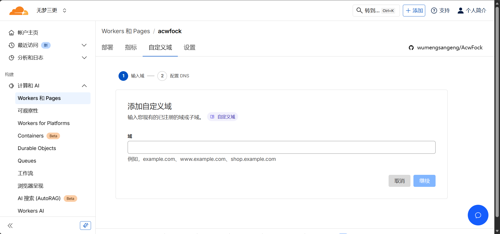
选择开始CNAME设置。
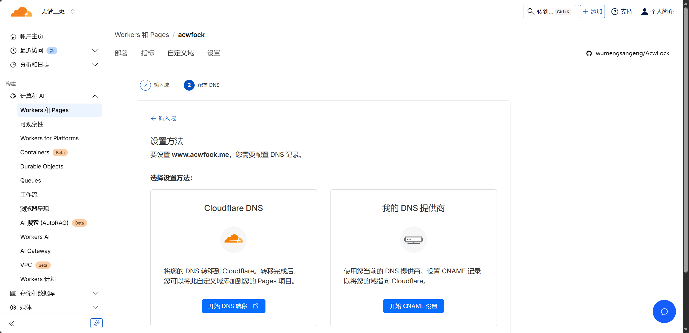
按照要求添加记录，完成认证，这里是暂时的先将SSL证书签发下来，之后我们再改成优选域名。
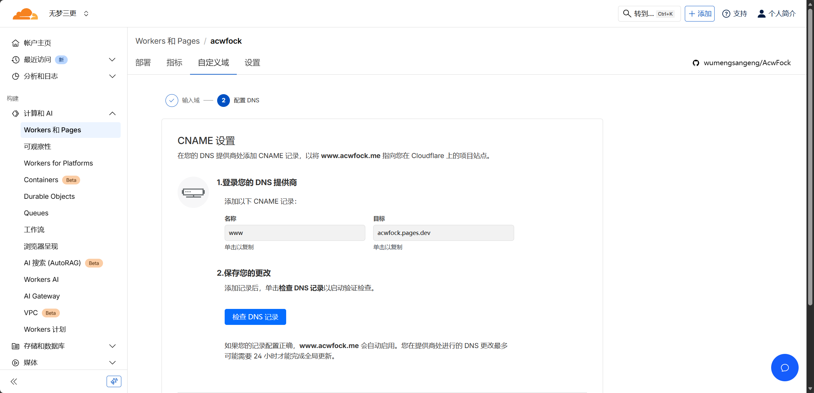
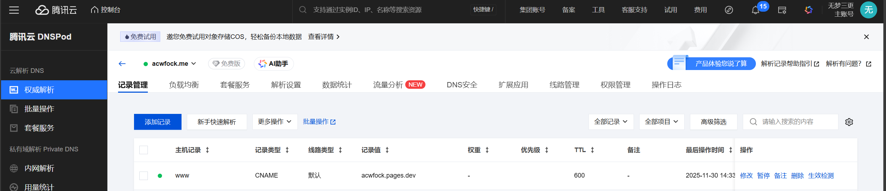
显示为 `活动` 就设置成功了。
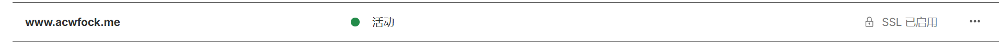

最后将访问域名的DNS解析指向优选域名 `CNAME www.acwfock.me --> 如 cf.090227.xyz` 即可，当然也可以是自建的优选。

# 结语

至此踩了这么多坑才将优选配完。累死了！

还有一个坑，千万不要先配Page再配自定义域名，因为在配自定义域名时会提示指向 `cloudflare` 报错。